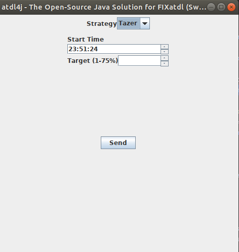

# Algo Trading Example
This project is example for understanding atdl and fix protocol. Some part of implementation is still missing, see TODO section below. 
We have 3 java modules. 
* common: fix application has been implemented here and it is shared by provider and requester
* provider: this is representing provider fix engine, it has fix session config under provider/src/main/resources/fixsession_initiator.conf
* requester: this is representing requester fix engine, it has fix session config under requester/src/main/resources/fixsession_acceptor.conf

## Usage
*  run requester module, it will open the Strategy Parameters GUI as the following screenshot shows. It also starts a fix engine in acceptor mode.

* run provider module, it will initiate fix connection into requester session.
* update parameter in Strategy Parameters GUI and click send, this will create a NewOrderSingle and will send to provider
* provider will book order on its side and will send ExecutionReport in accepted status
* once order is executed in provider side, they push executionReports in filled or partil filled state.

## Run

# TODO
* provider doesn't send ExecutionReport back, this needs to be implemented

# Technology Stack
* Java
* Atdl4j
* QuickFix4j
* log4j2
